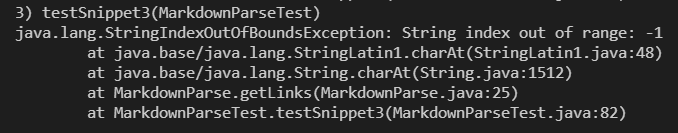

UCSD CSE 15L Week 8 Lab Report 4: Github Access from ieng6 (Choice 2)
========================
## Links to tested repos
[My repo](www.example.com)  
[Reviewed Repo](www.example.com)  

## Test 1
### Expected output
  
```
[`google.com, google.com, ucsd.edu]  
```
### Test code
  
### My implementation's results
  
### Reviewed repo's results


## Test 1
### Expected output
  
```
[a.com, a.com(()), example.com]
```
### Test code

### My implementation's results
  
### Reviewed repo's results


## Test 1
### Expected output
  
```
```
### Test code

### My implementation's results
  
### Reviewed repo's results


## Workload of Correcting Errors
### Snippet 1
Adapting my current code to account for backticks and code blocks should take less than 10 lines. I should only have to check if a backtick exists before the open bracket, and see if it has a matching backtick inside the link definition, in which case the link should not be valid.
### Snippet 2
My code would likely need moderate refactoring in order to account for nested parentheses and brackets. I would likely have to write code that can match parentheses, which is an entire algorithm have to implement, as well as what to do when parentheses/brackets aren't properly paired. However, checking for escaped characters and skipping them should be easy since I only have to check for a backtick before characters of significance like brackets.  
### Snippet 3
The thing that is being tested in snippet 3, which is multi-line titles and links, should be easy to account for. I simply don't check for newlines in the title, but do check for newlines in the link (and consider the link invalid if they appear before the closing parenthesis). The IndexOutOfBounds exception I got should also be a <10 line fix because I believe I only have to do more indexOf = -1 checks for characters I haven't already done it for.