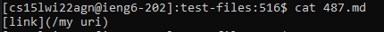
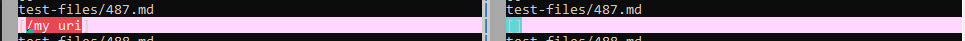
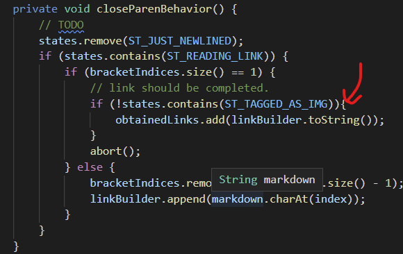
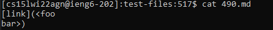
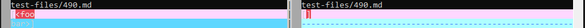
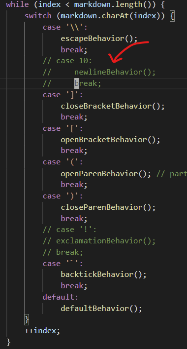

UCSD CSE 15L Lab 10 Report: Comparing Code
=================================

## How did I find the tests?
1. I ran script.sh from the Week 9 lab in both my fork of markdown-parse repo and ucsd's markdown-parse repo. As part of the command, I redirected the output to `results_ryan.txt` and `results_ucsd.txt`, respectively. 
2. I ran `vimdiff` on both result files. 
3. I observed the highlighted portions of the files and selected two pairs of them to be my different results. 

## Test 1
### The test  
  
### The (different) results  
  
### Which is Correct?
I believe the ucsd implementation (right diff) produces the correct output. There 
is a space inside what is supposed to be the link, so the link is broken up and 
should count as invalid. 

### The Bug and the Fix

The issue with my code is that it doesn't check if the link has any illegal whitespaces.
I can fix this by using indexOf upon completing a potential link to test if there are 
any illegal characters inside of it. Presently I only have a check for whether the link
is an image. 

## Test 2
### The test  
  
### The (different) results  
  
### Which is Correct?
I believe that the ucsd implementation (right diff) produces the correct output.
The link was broken in the middle by a newline, so it should not be considered 
a link. 

### The Bug and the Fix
  
My code does not check for newlines in the middle of links. To fix this, I will have 
to be able to check if the character before the newline is an opening parenthesis
that is precedes the start of the link (and therefore I will need to be able to 
differentiate between a nested parenthesis within the link and a link-preceding 
parenthesis.) Because different operating systems differ in what characters they 
considered newlines (CRLF for windows, LF for Linux and Mac), I will likely have to 
figure out how to change behavior depending on the operating system my program runs
on. I cannot simply use \n because markdown files don't translate \n into an LF or 
an EoL by themselves like Java does. While accounting for all these things, I also
have to maintain the ability to stop reading a line if there are two newlines between
an opening/closing parenthesis and the link proper. 