UCSD CSE 15L Lab 1 Report: How to Remotely Access UCSD Servers
=================================================
## Why this Article?
This article was written as part of an assignment for UCSD's CSE 15L class. However, I also intend for this to be a simple guide for myself and others about how I can run the command line on a server.  

## Installing VS Code
As I already had VS Code installed long before the assignment even began, this will be a recount of how I probably would have done it if it wasn't installed.  
First, I would go to [Link]https://code.visualstudio.com/ (or just look up vscode on Google). I would see a big blue button in the center of the screen saying "Download for Windows," which I would click (Mac users, I would presume would see "Download for Mac").  
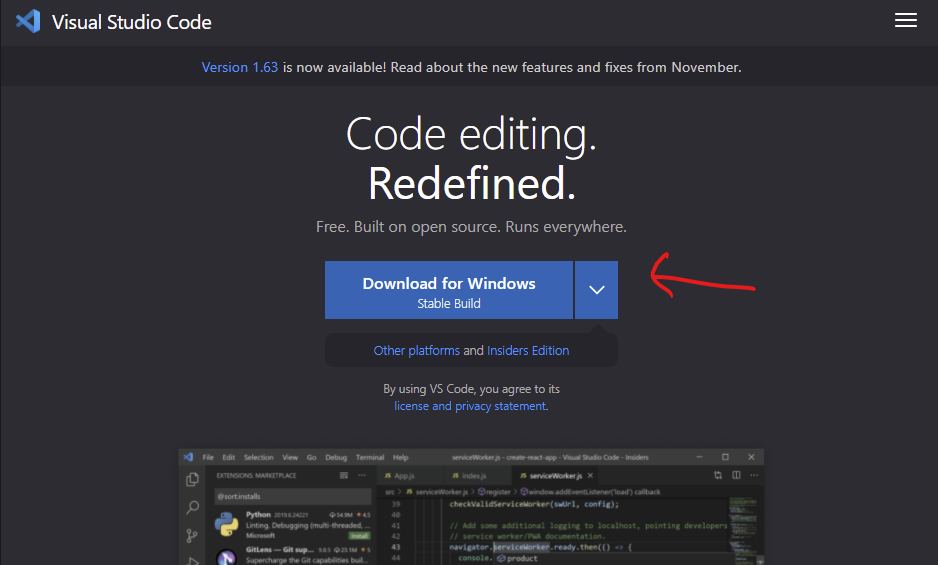  
The setup wizard should be installed when I do.  
I would work through the setup wizard. Under "Other," I would check all of the options like so:  
  
This is because I actually like to use code to edit my files. It's somehow aestheically pleasing to use, compared to things like Notepad++. Checking all items allows me to access VS Code more easily for different file types.  
Then I would click Install, and I should be able to open the VS Code application, whether it be via Desktop shortcut or Start Menu shortcut.  
## Remotely Connecting
We will start by making sure SSH is actually installed on our computer. The instructions can be found at [this website](https://docs.microsoft.com/en-us/windows-server/administration/openssh/openssh_install_firstuse#install-openssh-using-windows-settings), but I will summarize the steps for Windows here.  
First, open your computer's Settings and select Apps and Features (or open it from the Start Menu). There is an Apps & Features section under the Apps & Features Page. Right under the header, there is an _Optional Features_ link you should click.  
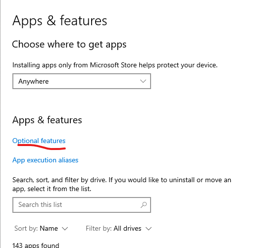  
Search the _Installed Features_ for OpenSSH and check if you have the client installed. If not, click _Add a Feature,_ search and select _OpenSSH Client_, and install it.  
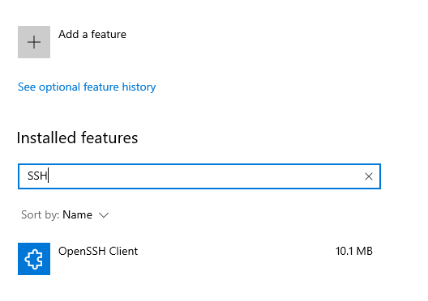  
I usually use an external terminal to remotely connect to a server. However, CSE 15L recommends that you open a Terminal within VS Code, which you can do by selecting View -> Terminal, or by pressing CTRL+\`. Once you have a terminal open, our goal is to log into your account on the ieng6 server (essentially a folder that you have permission to use on a remote computer). You can do so by typing `ssh [username]@ieng6.ucsd.edu`. To find out your username, go to the [UCSD Account Lookup page](https://sdacs.ucsd.edu/~icc/index.php) and log in. You should see under additional accounts the names of your accounts. If you are in CSE 15L, your account username should start with "cs15l." Use this username to log in using ssh.  
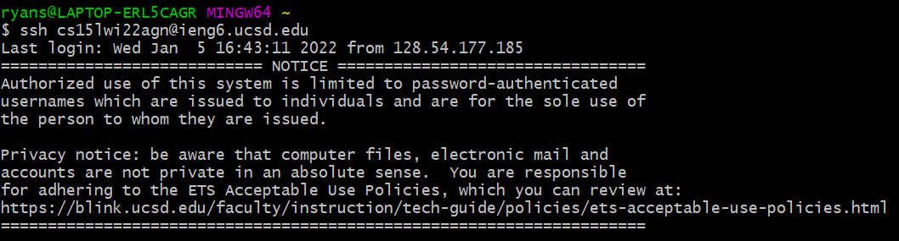  
You will probably have to type in your UCSD account password to log in. It is possible that you may have to change your password to activate your account, which you can also do through the UCSD Account Lookup tool. 
## Trying Some Commands
Here are some commands to try:
* `cd [path]` (Change Directory. To backtrack, type cse15l-lab-reports)
* `ls` (LiSt files in output)
* `pwd` (prints the Present Working Directory, or the directory you're currently opening, to output)
* `echo [option]` (ECHO what you typed as output)
* `touch [filename]` (make a file)
* `rm [name]` (ReMove file with the given name)
* `mkdir [name]` (make directory, or make folder)
* `rmdir [name]` (ReMove directory with the given name)
* `cp [name] [destination]` (CoPy file to destination)
* `mv [name] [destination]` (MoVe file or directory to destination)

What's interesting is that these commands don't work by default on Windows. The Windows command prompt and Powershell uses a different set of commands. The reason that you are able to use these commands (if you have a windows computer) is because you are actually working on a Linux machine through your remote connection, and Linux shells (and by extension, Mac shells) have access to these commands. There are ways to make Windows mimic Linux commands, however, which will probably be explained later in the course.
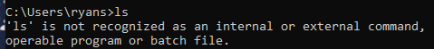  
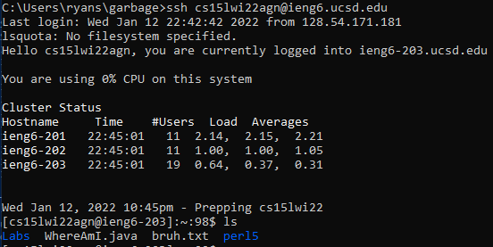  
If you were curious, the Windows Command Line equivalent of `ls` is `dir`
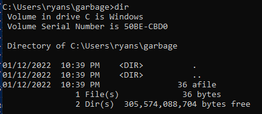  
## Moving Files with scp
Secure Contain Protect lmao  
`scp` essentially allows you to copy files from your computer to a server. The command goes  
``` 
scp [file] [username]@ieng6.ucsd.edu:[destination-path]
```  
[destination-path] should be replaced with the path of the directory that you want to place your file in. The "~" (tilda) character represents the home directory, which is the directory you open when you first log in using SSH. It can (and should) be used as part of [destination-path], as in `~\mydirectory` or simply `~`.  
Here is an exapmle of the usage:  
I have created a file called "afile" containing some text.  
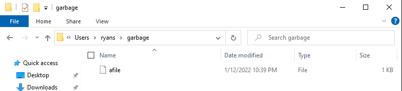  
Here is a usage of scp on afile, copying it to the home directory. I also log in to the folder to show that it has now appeared in the home directory.  
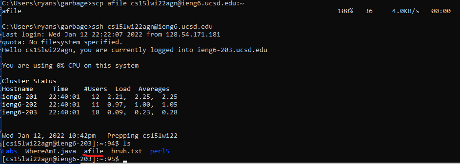  
You can also type a new name for the copied file as part of the `[destination-path]` (e.g. `~\mydirectory\newfilename`). This will generate a new file, which will then receive the copied contents from the client. 
You will also have to type in your password. to use this service.  
## Setting an SSH Key  
The more complex your password, the more annoying it is to have to type it in. Wouldn't it be nice if the server could automatically detect that the computer you're logging in with is _yours,_ and automatically let you in? While apparently not the most secure method of logging in (according to the CSE 15L teacher), it is possible.  
Open a terminal on your client (nothing needs to be done on the server yet). Run `ssh-keygen`. Use the default keygen path by pressing Enter/Return when prompted for a file location to save the generated key. However, if you're asked to overwrite an existing key, it may be in your interest to not overwrite it and save it to another file in the same location (you will probably be able to use C:/Users/username/.ssh/[your-key-name]).  
For convenience, do not enter a password, or enter a simpler one than your default UCSD account password. In your home directory (usually C:/Users/username) you should now see a .ssh file. Within it should be a file called id\_rsa.pub, which is the "public" key generated by `ssh-keygen`. We will want to copy this file to the server, but to a particular location.  
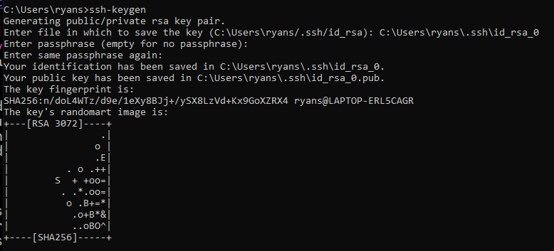  
Log into the server and create a directory called .ssh. Once it is created, you may not see it using `ls` because the period in front of the file name labels it as "hidden." However, you will be able to view it using `ls -a`.  
Log out. go to the .ssh folder on your computer and run scp on id\_rsa.pub, copying it to `~\.ssh\authorized_keys`. Since `authorized_keys` is not a directory in .ssh, it will be generated as a file.  
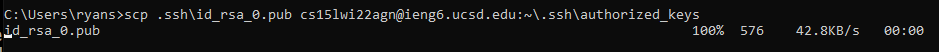  
At this point, I was able to log on without a password because I used the default key name id\_rsa. However, if you went with a custom name for your ssh key, you will need run `ssh-add` on your key. There is a procedure for this that can be found at [this page](https://docs.microsoft.com/en-us/windows-server/administration/openssh/openssh_keymanagement#user-key-generation) at the bottom of the User Key Generation section. Essentially, you will be starting up a service called ssh-agent, which will enable you to run `ssh-add`. This must be done in PowerShell, ran with administrator permissions, which you can do by right-clicking the shorcut and selecting "Run as Administrator". Then you can run start the ssh-agent and run ssh-add as described in the Microsoft documentation.  
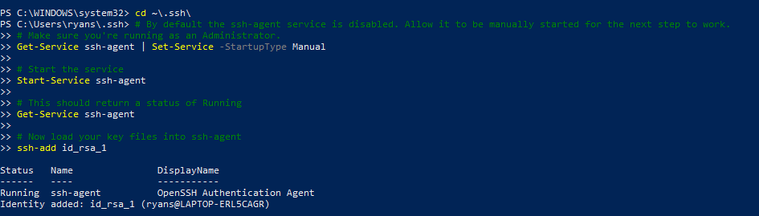  
You're done! From now on you can log onto the server without a password.  
## Optimizing Remote Running
Generally, compiling and running java files on a remote server utilizes similar commands in similar order. You can speed up the remote running workflow by copying those commands to a file and pasting them whenever you need to.  
In order to log onto the server and run commands on it, you will need to use the command `ssh [username]@ieng6.ucsd.edu [command]`. If you simply try to copy multiple lines where you log in on an earlier line and your server commands on a later line, you will find that the commands stop executing while you are logged onto the server, and only continue executing after logging off of the server. Avoid this by using the aformentioned command, which will run any commands written in `[command]` on the server and then log off automatically.   
On Linux machines, you can combine multiple commands into one line by separating with a semicolon in the format `[command1];[command2];[command3];[etc]`. For example, `echo hi;echo world` will write "hi" and then "world" to output, as though you had run them on two separate lines. This can help you compact  commands into fewer lines, at least on Linux machines. 
If you want to run multiple commands on ssh, you will need to surround your `[commands]` with quotes. The command would look like:  
```
ssh [username]@ieng6.ucsd.edu "[command1];[command2];[etc]"  
```
In general, it is probably a good habit to always use quotes when running commands on a server like this, even if you're only running one.  
Here is an image of a file I can copy and paste into the command line that will allow me to copy a java file called WhereAmI.java into my folder on the server and run it:  
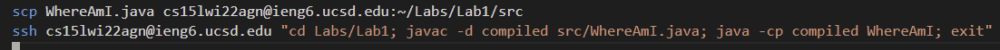  
Here is an image of the commands in action:  
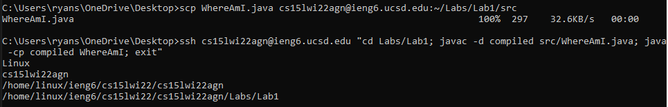  
A better way to speed up the remote run process is to create a batch file (at least, on Windows) that does the work for you simply by running the file. We will probably end up learning about batch files or similar scripts later.  
