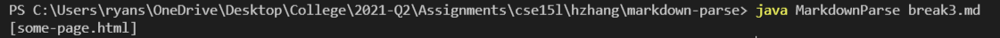

UCSD CSE 15L Lab 2 Report: Evolving Code
========================================

## Fix 1  

  
## [Link to failure-inducing input](https://raw.githubusercontent.com/ryan-s-lee/markdown-parse/main/break4.md)  
  
  
(The picture above is the initial result; the picture below is the result after letting the program run awhile.)  
Prior to this code change, adding text after the last link caused the Markdown Parser to run in an infinite loop. The failure-inducing input contained text after a final link, causing the terminal application to freeze. This was caused by a bug where the while loop would only end if the currentIndex index was higher than the length of the markdown file, but the currentIndex would constantly be set to -1 due to the indexOf function not finding the opening bracket. Its use in the indexOf function did not throw an error, as negative numbers are valid parameters for the function. Checking if indexOf returned -1 when searching for the opening bracket that starts a link and breaking the while loop if it does prevents the while loop from running infinitely in the case there is text after the final link. 

## Fix 2  

  
## [Link to failure-inducing input](https://github.com/ryan-s-lee/markdown-parse/blob/main/break2.md)  
  
Prior to this code change, links that contained closing parentheses would be truncated, breaking the link. The failure-inducing input contained such a link, and the output printed a truncated version of it. The bug that caused this was the check for the closing parentheses, which checked the first closing parenthesis after the link's opening parenthesis regardless of whether it was part of the link. Our group decided that in the event that a closing parenthesis was immediately preceded by an opening parenthesis, the closing parentheses would be considered part of the link, because apparently links can't end with an open parenthesis. Therefore, we fixed the issue by checking for the presence of an opening parenthesis before any closing parenthesis we find. If there is one, we continue the search for another closing parenthesis that would end the link starting from the character after the closing parenthesis we just found. 

## Fix 3  

  
## [Link to failure-inducing input](https://github.com/ryan-s-lee/markdown-parse/blob/main/break3.md)  
  
Prior to this code change, images would be considered the same as links. While this is effectively true once the image is hosted online, our group wanted to differentiate them, especially considering how relative image links will not function like normal links. In the failure-inducing input, an explanation mark precedes what would normally be a link, making it an image; however, the image is still counted as a link and its path is listed in the output. The bug that caused this was the absence of a check for an exclamation mark preceding the link markdown's opening bracket. Adding this check after finding the nextOpenBracket index, making sure to check that the open bracket is not 0 (which would cause an IndexOutOfBounds exception if we tried to check the character before it), resolved this issue for the failure-inducing input. 